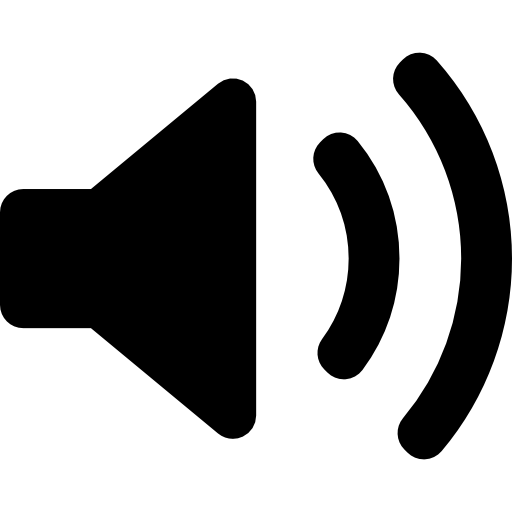

<p align="center">
  
</p>

<h1 align="center">Sound Control Panel</h1>

<p align="center">
  A modern, sleek replacement for the legacy Windows Sound Manager — built with Electron, React, and a native C# audio bridge.
</p>

<p align="center">
  
  
  
  
</p>

---

## ✨ Features

| Feature | Description |
|---|---|
| **Playback & Recording Tabs** | Browse all audio endpoints, grouped by type, with badge counts |
| **Set Default Device** | One-click default device switching (sets both default and default communication device) |
| **Volume Mixer** | Per-application volume control with mute toggles and live peak meters |
| **Device Configuration** | Adjust master volume, mute, per-channel levels, sample rate, and bit depth |
| **Device Properties** | View hardware details — driver, interface, format, state, and more |
| **Live Peak Meters** | Real-time audio level visualisation polled from the native bridge |
| **Custom Title Bar** | Frameless window with a draggable title bar and window controls |
| **Dark UI** | AMOLED-black background with vibrant purple accents and smooth animations |

---

## 🏗️ Architecture

```
Sound Control Panel
├── main/               # Electron main process (JS)
│   ├── main.js          # Window creation, IPC handlers, bridge management
│   └── preload.js       # Context-isolated API exposed to the renderer
├── src/                 # React renderer (TypeScript + Vite)
│   ├── App.tsx           # Root component — tabs, modals, bottom bar
│   ├── components/       # UI components
│   │   ├── TabBar.tsx         # Playback / Recording / Mixer tabs
│   │   ├── DeviceList.tsx     # Scrollable list of devices
│   │   ├── DeviceItem.tsx     # Individual device row with actions
│   │   ├── VolumeMixer.tsx    # Per-app session mixer
│   │   ├── VolumeMeter.tsx    # Animated peak meter bar
│   │   ├── ConfigureModal.tsx # Volume, channels, format config
│   │   ├── PropertiesModal.tsx# Hardware/driver info dialog
│   │   └── TitleBar.tsx       # Custom frameless title bar
│   ├── hooks/
│   │   └── useAudioDevices.ts # Data-fetching hook with polling
│   ├── types.ts          # Shared TypeScript interfaces
│   ├── index.css         # Full design system & styles
│   └── main.tsx          # React entry point
├── native/              # C# native audio bridge
│   └── AudioBridge/
│       ├── Program.cs         # stdin/stdout JSON-RPC loop
│       ├── AudioManager.cs    # Windows Core Audio API wrapper
│       ├── PolicyConfig.cs    # COM interop for default device policy
│       └── AudioBridge.csproj # .NET project file
├── index.html           # HTML shell
├── vite.config.ts       # Vite config (React plugin, renderer output)
└── package.json         # Scripts, deps, electron-builder config
```

### How it works

1. **Electron main process** spawns the C# `AudioBridge.exe` as a child process.
2. Commands are sent over **stdin** as newline-delimited JSON; responses come back on **stdout**.
3. The **React renderer** calls IPC handlers exposed through `preload.js` (context-isolated).
4. If the native bridge isn't available, the app falls back to **mock data** for development.

---

## 🚀 Getting Started

### Prerequisites

- [Node.js](https://nodejs.org/) ≥ 18
- [.NET 8 SDK](https://dotnet.microsoft.com/download) (for the native bridge)
- Windows 10/11

### Install Dependencies

```bash
npm install
```

### Build the Native Bridge

```bash
npm run build:native
```

This publishes the C# project to `native/bin/`.

### Run in Development

```bash
npm run dev
```

Starts the Vite dev server and launches Electron with hot-reload.

### Build for Production

```bash
# Build the renderer
npm run build

# Package as an installer
npm run dist
```

The installer is output to the `release/` directory.

---

## 📜 Scripts

| Script | Description |
|---|---|
| `npm run dev` | Run Vite + Electron concurrently (hot-reload) |
| `npm run dev:renderer` | Start only the Vite dev server |
| `npm run dev:electron` | Start only Electron (waits for Vite) |
| `npm run build` | Build the renderer to `dist-renderer/` |
| `npm run build:native` | Publish the C# AudioBridge to `native/bin/` |
| `npm run start` | Build renderer then launch Electron |
| `npm run dist` | Build renderer + package with electron-builder |

---

## 🛠️ Tech Stack

- **Frontend** — React 18 · TypeScript · Vite 6
- **Desktop Shell** — Electron 33
- **Native Audio** — C# / .NET 8 · Windows Core Audio API (MMDevice, IAudioSessionManager2)
- **IPC** — stdin/stdout JSON-RPC between Electron ↔ C# bridge
- **Packaging** — electron-builder (NSIS installer, x64)

---

## 📁 Project Structure Summary

| Layer | Technology | Purpose |
|---|---|---|
| Renderer | React + TypeScript + Vite | UI components, state management, styling |
| Main Process | Electron (Node.js) | Window management, IPC routing, bridge lifecycle |
| Native Bridge | C# (.NET 8) | Windows Core Audio API access, JSON-RPC server |

---

## 📄 License

This project is for personal use.
